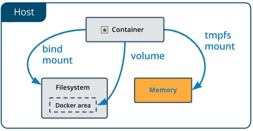

Writing tests is good practice. Working on TDD (Test Driven Development) is even better. Laravel has everything you need for testing — PHPUNit, integration with it, ready-made examples when installing the framework — you can just go and start writing tests without additional settings.

Tests are divided into Unit — which test the code in isolation from the application, and Feature — which test the functionality of the application. Feature tests acceleration will be discussed in this article.

When writing Feature tests, the code is not isolated — we test exactly the application functions, using, among other things, the database. However, each test must be isolated from each other, for which, among other things, Laravel has the DatabaseMigrations and RefreshDatabase traits — which completely update the database before each test.

# The Problem
Feature tests are SLOW as full migration is very expensive operation! And they SLOW DOWN with every added migration and every new test. On a large project, tests can take tens of minutes!

One of the solutions to this problem is the use of SQLite in memory (you can read more about this approach, for example, here), but this brings even more problems — SQLIte is very different from “real” databases and requires code improvement for yourself — **which, in my opinion , unacceptable.**

# The Solution
## TL;DR
One line in docker-compose that will mount the database data folder into RAM. More information in docker documentation. Add to database service, example for MySQL
```yaml
mysql:
  image: mysql:5.7
  tmpfs: /var/lib/mysql
```

## Synthetic example
Let’s create a new Laravel project and run it in docker-compose.
```
max@DESKTOP:~/DEV$ composer create-project --prefer-dist laravel/laravel blazing-speed-test
max@DESKTOP:~/DEV/$ cd blazing-speed-test
```
Create docker-compose.yml
```yaml
version: '3'
services:
  php:
    working_dir: "/app"
    image: thecodingmachine/php:7.4-v3-fpm
    environment:
      DB_HOST: mysql
    volumes:
      - ./:/app

  mysql:
    image: mysql:5.7
    environment:
      MYSQL_ALLOW_EMPTY_PASSWORD: 1
      MYSQL_DATABASE: laravel
```

***NB**: This is a very simplified and unoptimized compose file that should not be used in real projects. But this article is about testing, not using docker-compose in local development.*

Now let’s write a synthetic test to show benefits of tmpfs. To do this, we will slightly modify the test that is provided to us during installation — we will add a trait and a dataProvider to be able to set the number of tests.

**tests\Feature\ExampleTest.php**
```php
class ExampleTest extends TestCase
{
    use DatabaseMigrations;

    /**
     * A basic test example.
     *
     * @dataProvider providerBasicTest
     * @return void
     */
    public function testBasicTest()
    {
        $this->get('/')
            ->assertSuccessful();
    }

    public function providerBasicTest()
    {
        $count = 15;
        return array_fill(0, $count, [1]);
    }
}
```
***NB**: I added about 10 migrations from a real project for this test — using base migrations is not indicative. Migration data is omitted in the article, but you can add your own from any project for testing.**

Run Feature tests
```bash
max@DESKTOP:~/DEV/blazing-speed-test$ docker-compose exec php vendor/phpunit/phpunit/phpunit --testsuite Feature
PHPUnit 9.4.3 by Sebastian Bergmann and contributors.
...............
15/ 15 (100%)
Time: 01:41.025, Memory: 28.00 MB
OK (15 tests, 15 assertions)
```

Remember, 15 tests with migrations passed in 01:41

Add tmpfs to **docker-compose.yml**
```yaml
mysql:
  image: mysql:5.7
  tmpfs: /var/lib/mysql
  environment:
    MYSQL_ALLOW_EMPTY_PASSWORD: 1
    MYSQL_DATABASE: laravel
```
Restart the containers (docker-compose restart will not work) and try again

```bash
max@DESKTOP:~/DEV/blazing-speed-test$ docker-compose down -v
max@DESKTOP:~/DEV/blazing-speed-test$ docker-compose up -d
max@DESKTOP:~/DEV/blazing-speed-test$ docker-compose exec php vendor/phpunit/phpunit/phpunit --testsuite Feature
PHPUnit 9.4.3 by Sebastian Bergmann and contributors.
...............
15/ 15 (100%)
Time: 00:06.895, Memory: 28.00 MB
OK (15 tests, 15 assertions)
```

**BLAZING! 7 seconds! The speed has increased 14 times!**

This is a synthetic example, in real projects the profit is less. But definitely, using tmpfs for a database significantly speeds up tests and makes the developer happier!

# Cons
Since the data is stored in RAM, it will be lost after unmounting. Therefore, for testing, I suggest making a separate docker-compose service, which will be used only for testing, and override the database connection parameters in phpunit.xml

**docker-compose.yml**
```yaml
mysql_develop:
  image: mysql:5.7

mysql_testing:
  image: mysql:5.7
  tmpfs: /var/lib/mysql
```

**phpunit.xml**
```xml
<php>
    <server name="APP_ENV" value="testing"/>
    <server name="DB_HOST" value="mysql_testing"/>
    <server name="DB_DATABASE" value="testing"/>
    <server name="DB_USERNAME" value="testing"/>
    <server name="DB_PASSWORD" value="testing"/>
</php>
```