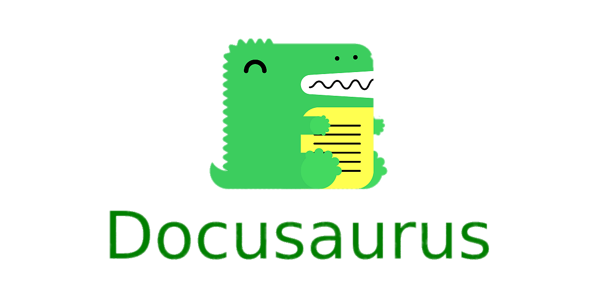

I want to talk about the experience of using Docosaurus for microservices. The article may be useful for those who maintain “manual” documentation on the Wiki.

# History
In my company, documentation has historically been maintained in Confluence. There have been several attempts to switch to Swagger, however, all of them were not successful for certain reasons.

Maintaining “manual” documentation was associated with a number of problems:

- **Laziness** — developers did not always make changes to the documentation when changing the code — because this needs to be done outside the IDE, exiting the stream.
- **Control** — it is quite difficult to control whether changes were made to the documentation during the code review.
- **Irrelevant** — you never know if the current documentation is up to date or not

Trying to solve these problems, I came up with the idea that if you write documentation along with the code, then all these problems will be solved.

However, the documentation needs to be accessible to those who don’t have access to the repositories — hence the need for an interface for this documentation.

# Static Site Generators
I’ve already had experience writing documentation using VuePress and Docusaur — which meet the “documentation in IDE” requirement. It remains only to add the ability to collect .md files from third-party repositories.

For this we need:
- Documentation (Yes, you must write it)
- Docusaurus project
- git-clone package
- Synchronisation script

# Writing documentation
In your service repository, create a .docs folder and in it — _category_.json ([docs](https://docusaurus.io/docs/sidebar/autogenerated#category-item-metadata))
```json
{
  "label": "Service name"
}
```
And write documentation! Use the .md format. Use pictures, nested directories, whatever you want — check [Docusaurus site](https://docusaurus.io/docs/docs-introduction).

Write it along with the code, check on code review as code, see history in git log.

# Docusaurus project

- Create a fresh (or use existing) Docusaurus project — [follow documentation](https://docusaurus.io/docs/installation).
- Install [git-clone](https://www.npmjs.com/package/git-clone) package
- Create folder for external docs — `./docs/services` and add ` ` file to this folder. You can change name of this folder check comments in script.

```
*
!.gitignore
```

# Synchronisation

In Docusaurus project, create a list of repositories from which we need to collect docs — `./repositories.json`
```json
{
  "services" : {
    "your-service" : {
      "repo": "git@gitlab.com:path/your_repo.git"
    }
  }
}
```

And clone script — `./docsSync.js`
```javascript
const fsAsync = require('fs/promises')
const fs = require('fs')
const path = require('path')
const os = require('os')
const clone = require('git-clone/promise.js')

const PROJECT_DOCS_FOLDER = '.docs' //folder in project which contain docs
const SERVICES_FOLDER = 'services' //folder to store cloned docs
const REPO_FILE = 'repositories.json' //file with repositories

fsAsync.readFile(REPO_FILE, "utf8")
    .then(function (data){
        let repositories = JSON.parse(data);
        fsAsync.mkdtemp(path.join(os.tmpdir(), 'docs-'))
            .then(function(tempDir){
                process(repositories.services, tempDir)
            }).catch((err) => console.log('Cannot read file: ' + err))
        })

function process(entries, tempDir)
{
    processEntries(entries, tempDir, function (repoPath, name){
        let docsPath = path.join('./docs/', SERVICES_FOLDER, name)
        if(fs.existsSync(docsPath)){
            fs.rmSync(docsPath, { recursive: true })
        }
        fs.cpSync(path.join(repoPath, PROJECT_DOCS_FOLDER), docsPath, {recursive: true});
    })
}
function processEntries(entries, tempDir, copyCallback)
{
    Object.entries(entries).forEach(([name, props]) => {
        cloneRepo(name, props.repo, tempDir, copyCallback)
            .then((name) => console.log(name + ' cloned'))
            .catch((err) => console.log(name + ' ' + err))
    })
}
async function cloneRepo(name, repo, temp, copyCallback)
{
    return new Promise(function(resolve, reject) {
        let repoPath = path.join(temp, name)
        return clone(repo, repoPath).then(function(){
            copyCallback(repoPath, name)
            resolve(name)
        }).catch((err) => reject(err))
    });
}
```
***NB**: I don’t know JS very well, so the code is a bit ugly. Improvements are welcome.*

# Usage
And let’s try — write in terminal `node docsSync.js`

You **MUST** have read access to all repositories listed in repositories.json

If all good — you see in terminal `your_service cloned` and docs appear in `./docs/services/your_service`

Run Docusaurus and check your docs in nice interface :)

# CI/CD
A couple of points about this collector and CI/СD:

- Give the runner account read rights to the repositories
- Add an import command to package.json
```
  "scripts": {
    "docs:update": "node docsSync.js",
    //other commands
  },
```
- Add this command before build (i’m using Gitlab)
```yaml
build:
  stage: build
  script:
    - npm install
    - npm run docs:update
    - npm run build
```

# Conclusion
This approach solves all the problems listed at the beginning of the article:
- **Laziness** — just open file and write docs in markdown
- **Control** — you must write docs with your code — otherwise you won’t pass the review
- **Irrelevant** — all docs are relevant — because all changes are accompanied by documentation

This implementation is really ugly — here must be a “push” synchronisation model, not “pull”.

But it works fine, collect actual docs and provide a beautiful interface for whole company.