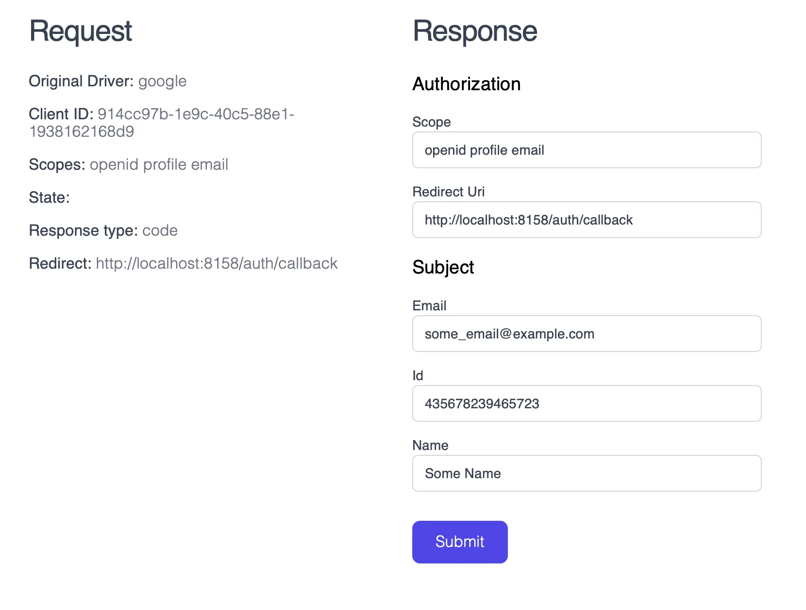

One day, during a long flight, I wanted to work on a project. It used Laravel Socialite with an external user provider as the only authorization mechanism.

Having deployed the project locally in Docker, I realized that I would not be able to log in — since there is no Internet on the plane, and login does not work without an external provider. I spent several hours and made a temporary crutch that allowed me to log in without calling an external service.

This idea formed the basis of the `freebuu/socialite-local` library — which intercepts requests from Socialite to the authentication service and allows login without access to the Internet.

# Installation
Installation via composer: `composer require -dev freebuu/socialite-local`

> MUST be installed as dev dependency due to security reasons.

After installation, interception of requests will work automatically. You can disable interception using the SOCIALITE_LOCAL_ENABLED variable by setting its value to false

# Usage
When calling Socialite with any driver, the request will be intercepted by the library and a redirect will occur to the login page provided by the library.
```
Socialite::driver('google')->redirect();
```


**Request** — details of the request sent by Socialite to the authorization service.

**Response** — a form for data that will be returned to Socialite from the authorization service.
- Scope — you can change the list of requested scopes — as if the user did not give all the requested permissions
- Redirect Url — you can change redirect url.
- Email, Id, Name — fields with external service user (eg. from Google). You get this user from Socialite::driver(‘google’)->user() after redirect back to Redirect Url.
>Since the id and email are specified arbitrarily, the library will allow you to log in as any user that is linked to an external provider in your system!

After clicking the Login button, a redirect will occur to the Redirect Url address — and your application will receive the user in the form it expects from the original provider.

# Conclusion
This library completely covers my needs for local development, and allows me not to depend on the Internet — which, in general, is very convenient.

Naturally, there are also issues that still need to be worked on:
- inability to set custom fields to the user
- no request history, data must be entered manually each time
- no simulation of authorization service errors